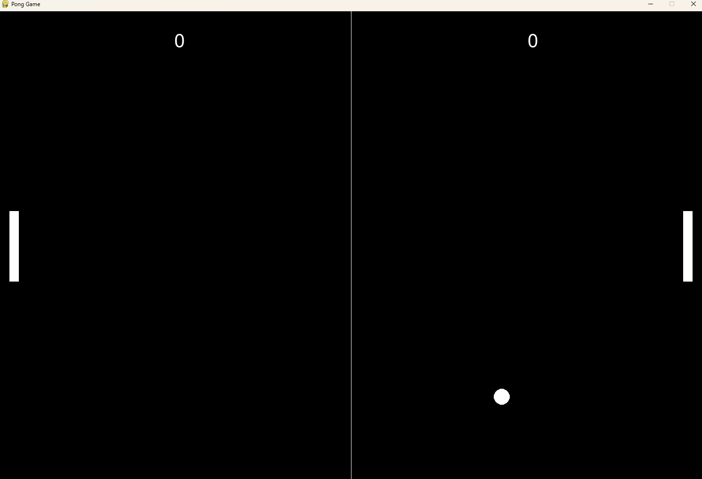

# Pong Game en Python

Este es un juego clásico de Pong, desarrollado en Python utilizando la biblioteca **Pygame**. El juego cuenta con dos palas que los jugadores pueden mover para golpear una pelota, intentando marcar goles en la paleta del oponente. Cada jugador tiene un puntaje y el objetivo es ser el primero en llegar a un puntaje determinado.

<p align="center">
  
</p>

## Características

- Dos jugadores pueden jugar de forma local.
- Palas que se mueven con las teclas `W` y `S` para el Jugador 1, y las teclas de flecha arriba (`↑`) y abajo (`↓`) para el Jugador 2.
- La pelota rebota en las paredes y las palas, y su velocidad aumenta con cada rebote.
- Se muestra el puntaje en la parte superior de la pantalla.
- El juego se reinicia automáticamente cuando un jugador marca un gol.

## Requisitos

Para ejecutar este juego, necesitas tener Python 3.x instalado, junto con la biblioteca **Pygame**.

### Instalación de Pygame

Si no tienes **Pygame** instalado, puedes instalarlo ejecutando el siguiente comando:

```bash
pip install pygame
